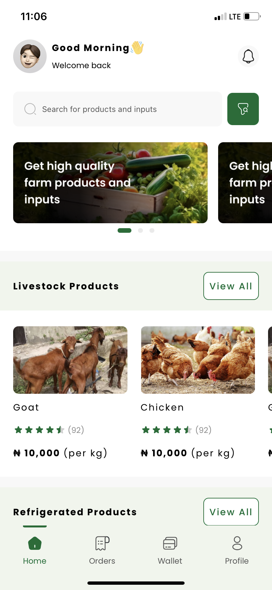
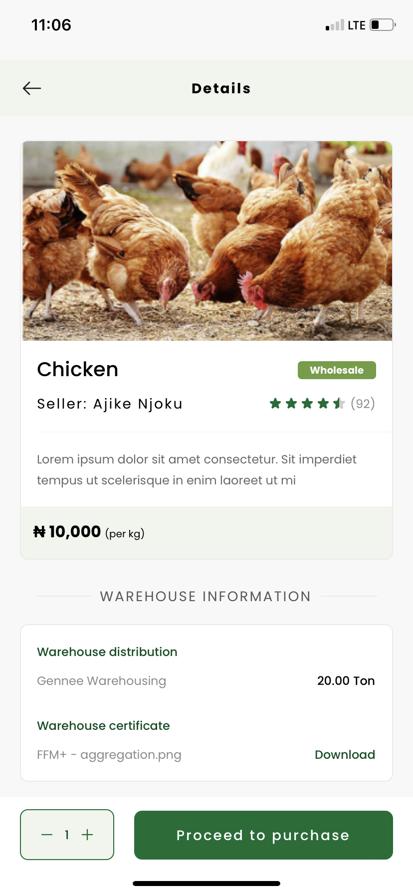

# Ajeoba Test

  

## Run Published App On Expo GO

Doenload Expo Go on app store or Play Store to run the app

    https://apps.apple.com/us/app/expo-go/id982107779
    https://play.google.com/store/apps/details?id=host.exp.exponent&hl=en&gl=US

Click the link below to open app

iOS

    exp://u.expo.dev/update/2bd51e0c-99ea-47f6-80cd-825d742fa471

Android

    exp://u.expo.dev/update/9b665b56-d37e-4a38-ac2e-baf1ac57df9f

## Clone git repository and install packages

    git clone https://github.com/OluwaferanmiLove/ajeoba.git
    cd ajeoba

Then install npm packages with yarn

    yarn install

Then install expo packages with

    npx expo install

## Run application

Start metro server

    npx expo start

Open Camera and scan QR code to run